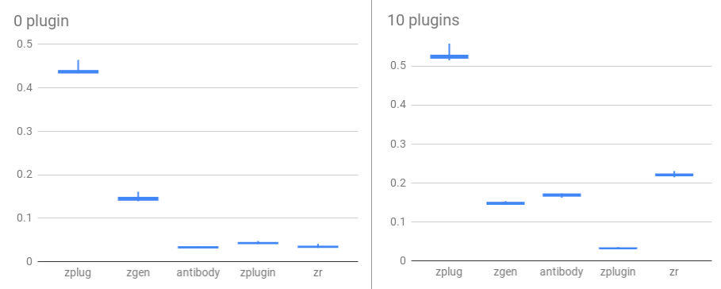

# Comparing Zsh plugin managers

## Requirements

- [hyperfine](https://github.com/sharkdp/hyperfine)

## Plugin Managers

- [zplug](https://github.com/zplug/zplug)
- [zgen](https://github.com/tarjoilija/zgen)
- [antibody](https://github.com/getantibody/antibody)
- [zplugin](https://github.com/zdharma/zplugin)
- [zr](https://github.com/jedahan/zr)

## How to measure

```
./startuptime.zsh zplugin.zsh
```


